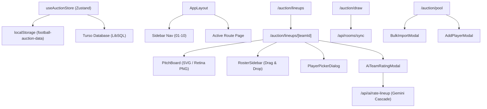

# 🗺️ Graphify Architecture Knowledge Graph

> **Eleven Football Auction Platform** — Auto-generated knowledge graph mapping all AST nodes, modules, dependency flows, and state interactions.

---

## 📊 Summary Metrics
- **Total Registered Nodes**: 132
- **Total Dependency Edges**: 407
- **Core Functional Domains**: 4

---

## 🏛️ Functional Domain Clusters

### 🔹 Tactical Lineup Engine
*Pitch visualization, 7 formations, slot drag & drop, squad roster, and retina PNG export.*

- **Entry Point**: [`src/app/auction/lineups/page.tsx`](file:///C:/Users/isliv/Desktop/auction/src/app/auction/lineups/page.tsx)
- **Associated Components & Modules**:
  - [`src/app/auction/lineups/[teamId]/page.tsx`](file:///C:/Users/isliv/Desktop/auction/src/app/auction/lineups/[teamId]/page.tsx)
  - [`src/components/lineups/lineup-builder-screen.tsx`](file:///C:/Users/isliv/Desktop/auction/src/components/lineups/lineup-builder-screen.tsx)
  - [`src/components/lineups/pitch-board.tsx`](file:///C:/Users/isliv/Desktop/auction/src/components/lineups/pitch-board.tsx)
  - [`src/components/lineups/roster-sidebar.tsx`](file:///C:/Users/isliv/Desktop/auction/src/components/lineups/roster-sidebar.tsx)
  - [`src/components/lineups/player-picker-dialog.tsx`](file:///C:/Users/isliv/Desktop/auction/src/components/lineups/player-picker-dialog.tsx)
  - [`src/components/lineups/ai-team-rating-modal.tsx`](file:///C:/Users/isliv/Desktop/auction/src/components/lineups/ai-team-rating-modal.tsx)
  - [`src/lib/formations.ts`](file:///C:/Users/isliv/Desktop/auction/src/lib/formations.ts)

### 🔹 Gemini AI Tactical Scouting Engine
*UEFA Pro calibrated squad review, 1-10 rating, sub-metrics, and key talisman detection with model fallback cascade.*

- **Entry Point**: [`src/app/api/ai/rate-lineup/route.ts`](file:///C:/Users/isliv/Desktop/auction/src/app/api/ai/rate-lineup/route.ts)
- **Associated Components & Modules**:
  - [`src/components/lineups/ai-team-rating-modal.tsx`](file:///C:/Users/isliv/Desktop/auction/src/components/lineups/ai-team-rating-modal.tsx)
  - [`src/app/api/ai/hype/route.ts`](file:///C:/Users/isliv/Desktop/auction/src/app/api/ai/hype/route.ts)

### 🔹 Live Auction & Room Sync System
*Real-time room code synchronization, live bidding, draw deck, wheel of fortune, and Turso persistence.*

- **Entry Point**: [`src/app/auction/draw/page.tsx`](file:///C:/Users/isliv/Desktop/auction/src/app/auction/draw/page.tsx)
- **Associated Components & Modules**:
  - [`src/app/api/rooms/route.ts`](file:///C:/Users/isliv/Desktop/auction/src/app/api/rooms/route.ts)
  - [`src/app/api/rooms/sync/route.ts`](file:///C:/Users/isliv/Desktop/auction/src/app/api/rooms/sync/route.ts)
  - [`src/app/api/rooms/draw/route.ts`](file:///C:/Users/isliv/Desktop/auction/src/app/api/rooms/draw/route.ts)
  - [`src/app/api/rooms/complete/route.ts`](file:///C:/Users/isliv/Desktop/auction/src/app/api/rooms/complete/route.ts)
  - [`src/lib/auction-store.ts`](file:///C:/Users/isliv/Desktop/auction/src/lib/auction-store.ts)
  - [`src/lib/turso.ts`](file:///C:/Users/isliv/Desktop/auction/src/lib/turso.ts)

### 🔹 Player Pool & Roster Management
*Player search, custom additions, CSV bulk-import with BOM & plain-text parsing, and points table tracking.*

- **Entry Point**: [`src/app/auction/pool/page.tsx`](file:///C:/Users/isliv/Desktop/auction/src/app/auction/pool/page.tsx)
- **Associated Components & Modules**:
  - [`src/components/auction/add-player-modal.tsx`](file:///C:/Users/isliv/Desktop/auction/src/components/auction/add-player-modal.tsx)
  - [`src/components/auction/bulk-import-modal.tsx`](file:///C:/Users/isliv/Desktop/auction/src/components/auction/bulk-import-modal.tsx)
  - [`src/components/auction/edit-player-modal.tsx`](file:///C:/Users/isliv/Desktop/auction/src/components/auction/edit-player-modal.tsx)
  - [`src/app/auction/points-table/page.tsx`](file:///C:/Users/isliv/Desktop/auction/src/app/auction/points-table/page.tsx)
  - [`src/app/api/players/search/route.ts`](file:///C:/Users/isliv/Desktop/auction/src/app/api/players/search/route.ts)
  - [`src/app/api/players/bulk-match/route.ts`](file:///C:/Users/isliv/Desktop/auction/src/app/api/players/bulk-match/route.ts)

---

## 🔄 Core Data & State Flow Graph

---

## 📁 Complete Node Index (132 Files)

| Node Path | Type | Exports |
| :--- | :--- | :--- |
| [`src/app/about/page.tsx`](file:///C:/Users/isliv/Desktop/auction/src/app/about/page.tsx) | `page` | metadata, AboutPage |
| [`src/app/api/ai/hype/route.ts`](file:///C:/Users/isliv/Desktop/auction/src/app/api/ai/hype/route.ts) | `api-route` | - |
| [`src/app/api/ai/rate-lineup/route.ts`](file:///C:/Users/isliv/Desktop/auction/src/app/api/ai/rate-lineup/route.ts) | `api-route` | - |
| [`src/app/api/music/route.ts`](file:///C:/Users/isliv/Desktop/auction/src/app/api/music/route.ts) | `api-route` | - |
| [`src/app/api/players/bulk-match/route.ts`](file:///C:/Users/isliv/Desktop/auction/src/app/api/players/bulk-match/route.ts) | `api-route` | - |
| [`src/app/api/players/custom/route.ts`](file:///C:/Users/isliv/Desktop/auction/src/app/api/players/custom/route.ts) | `api-route` | - |
| [`src/app/api/players/search/route.ts`](file:///C:/Users/isliv/Desktop/auction/src/app/api/players/search/route.ts) | `api-route` | - |
| [`src/app/api/players/[id]/route.ts`](file:///C:/Users/isliv/Desktop/auction/src/app/api/players/[id]/route.ts) | `api-route` | - |
| [`src/app/api/rooms/cards/route.ts`](file:///C:/Users/isliv/Desktop/auction/src/app/api/rooms/cards/route.ts) | `api-route` | - |
| [`src/app/api/rooms/complete/route.ts`](file:///C:/Users/isliv/Desktop/auction/src/app/api/rooms/complete/route.ts) | `api-route` | - |
| [`src/app/api/rooms/draw/route.ts`](file:///C:/Users/isliv/Desktop/auction/src/app/api/rooms/draw/route.ts) | `api-route` | - |
| [`src/app/api/rooms/join/route.ts`](file:///C:/Users/isliv/Desktop/auction/src/app/api/rooms/join/route.ts) | `api-route` | - |
| [`src/app/api/rooms/leave/route.ts`](file:///C:/Users/isliv/Desktop/auction/src/app/api/rooms/leave/route.ts) | `api-route` | - |
| [`src/app/api/rooms/roster/route.ts`](file:///C:/Users/isliv/Desktop/auction/src/app/api/rooms/roster/route.ts) | `api-route` | - |
| [`src/app/api/rooms/route.ts`](file:///C:/Users/isliv/Desktop/auction/src/app/api/rooms/route.ts) | `api-route` | - |
| [`src/app/api/rooms/sync/route.ts`](file:///C:/Users/isliv/Desktop/auction/src/app/api/rooms/sync/route.ts) | `api-route` | - |
| [`src/app/api/rooms/[code]/participants/route.ts`](file:///C:/Users/isliv/Desktop/auction/src/app/api/rooms/[code]/participants/route.ts) | `api-route` | - |
| [`src/app/auction/cards/page.tsx`](file:///C:/Users/isliv/Desktop/auction/src/app/auction/cards/page.tsx) | `page` | CardsPage |
| [`src/app/auction/draw/page.tsx`](file:///C:/Users/isliv/Desktop/auction/src/app/auction/draw/page.tsx) | `page` | DrawPage |
| [`src/app/auction/history/page.tsx`](file:///C:/Users/isliv/Desktop/auction/src/app/auction/history/page.tsx) | `page` | HistoryPage |
| [`src/app/auction/history/[id]/page.tsx`](file:///C:/Users/isliv/Desktop/auction/src/app/auction/history/[id]/page.tsx) | `page` | generateAuctionHistoryText, AuctionHistoryDetailPage |
| [`src/app/auction/lineups/page.tsx`](file:///C:/Users/isliv/Desktop/auction/src/app/auction/lineups/page.tsx) | `page` | LineupsPage |
| [`src/app/auction/lineups/[teamId]/page.tsx`](file:///C:/Users/isliv/Desktop/auction/src/app/auction/lineups/[teamId]/page.tsx) | `page` | TeamLineupPage |
| [`src/app/auction/page.tsx`](file:///C:/Users/isliv/Desktop/auction/src/app/auction/page.tsx) | `page` | DashboardPage |
| [`src/app/auction/points-table/page.tsx`](file:///C:/Users/isliv/Desktop/auction/src/app/auction/points-table/page.tsx) | `page` | PointsTablePage |
| [`src/app/auction/pool/page.tsx`](file:///C:/Users/isliv/Desktop/auction/src/app/auction/pool/page.tsx) | `page` | PoolPage |
| [`src/app/auction/settings/page.tsx`](file:///C:/Users/isliv/Desktop/auction/src/app/auction/settings/page.tsx) | `page` | SettingsPage |
| [`src/app/auction/vibe/page.tsx`](file:///C:/Users/isliv/Desktop/auction/src/app/auction/vibe/page.tsx) | `page` | AuctionVibePage |
| [`src/app/auction/vinyl/page.tsx`](file:///C:/Users/isliv/Desktop/auction/src/app/auction/vinyl/page.tsx) | `page` | AuctionVinylPage |
| [`src/app/auction/wheel/page.tsx`](file:///C:/Users/isliv/Desktop/auction/src/app/auction/wheel/page.tsx) | `page` | WheelPage |
| [`src/app/cards/page.tsx`](file:///C:/Users/isliv/Desktop/auction/src/app/cards/page.tsx) | `page` | DirectCardsPage |
| [`src/app/credits/page.tsx`](file:///C:/Users/isliv/Desktop/auction/src/app/credits/page.tsx) | `page` | metadata, CreditsPage |
| [`src/app/globals.css`](file:///C:/Users/isliv/Desktop/auction/src/app/globals.css) | `page` | - |
| [`src/app/how-it-works/page.tsx`](file:///C:/Users/isliv/Desktop/auction/src/app/how-it-works/page.tsx) | `page` | HowItWorksPage |
| [`src/app/layout.tsx`](file:///C:/Users/isliv/Desktop/auction/src/app/layout.tsx) | `page` | metadata, RootLayout |
| [`src/app/page.tsx`](file:///C:/Users/isliv/Desktop/auction/src/app/page.tsx) | `page` | LandingPage |
| [`src/app/template.tsx`](file:///C:/Users/isliv/Desktop/auction/src/app/template.tsx) | `page` | Template |
| [`src/app/vibe/page.tsx`](file:///C:/Users/isliv/Desktop/auction/src/app/vibe/page.tsx) | `page` | DirectVibePage |
| [`src/app/vinyl/page.tsx`](file:///C:/Users/isliv/Desktop/auction/src/app/vinyl/page.tsx) | `page` | DirectVinylPage |
| [`src/app/wheel/page.tsx`](file:///C:/Users/isliv/Desktop/auction/src/app/wheel/page.tsx) | `page` | WheelDirectPage |
| [`src/components/auction/add-player-modal.tsx`](file:///C:/Users/isliv/Desktop/auction/src/components/auction/add-player-modal.tsx) | `component` | AddPlayerModal |
| [`src/components/auction/assignment-panel.tsx`](file:///C:/Users/isliv/Desktop/auction/src/components/auction/assignment-panel.tsx) | `component` | AssignmentPanel |
| [`src/components/auction/bulk-import-modal.tsx`](file:///C:/Users/isliv/Desktop/auction/src/components/auction/bulk-import-modal.tsx) | `component` | BulkImportModal |
| [`src/components/auction/draw-screen.tsx`](file:///C:/Users/isliv/Desktop/auction/src/components/auction/draw-screen.tsx) | `component` | DrawScreen |
| [`src/components/auction/player-hype.tsx`](file:///C:/Users/isliv/Desktop/auction/src/components/auction/player-hype.tsx) | `component` | PlayerHype |
| [`src/components/auction/unsold-players-modal.tsx`](file:///C:/Users/isliv/Desktop/auction/src/components/auction/unsold-players-modal.tsx) | `component` | UnsoldPlayersModal |
| [`src/components/cards/cards-data.ts`](file:///C:/Users/isliv/Desktop/auction/src/components/cards/cards-data.ts) | `component` | CustomAuctionCard, DEFAULT_POWER_CARDS, DEFAULT_SICK_CARDS |
| [`src/components/cards/cards-screen.tsx`](file:///C:/Users/isliv/Desktop/auction/src/components/cards/cards-screen.tsx) | `component` | CardsScreen |
| [`src/components/cards/coverflow-carousel.tsx`](file:///C:/Users/isliv/Desktop/auction/src/components/cards/coverflow-carousel.tsx) | `component` | CoverflowCarouselProps, CoverflowCarousel |
| [`src/components/core/animated-number.tsx`](file:///C:/Users/isliv/Desktop/auction/src/components/core/animated-number.tsx) | `component` | AnimatedNumberProps, AnimatedNumber |
| [`src/components/credits/star-wars-crawl.tsx`](file:///C:/Users/isliv/Desktop/auction/src/components/credits/star-wars-crawl.tsx) | `component` | StarWarsCrawl |
| [`src/components/landing/background-slideshow.tsx`](file:///C:/Users/isliv/Desktop/auction/src/components/landing/background-slideshow.tsx) | `component` | BackgroundSlideshow |
| [`src/components/layout/app-layout.tsx`](file:///C:/Users/isliv/Desktop/auction/src/components/layout/app-layout.tsx) | `component` | AppLayout |
| [`src/components/layout/dynamic-island-music.tsx`](file:///C:/Users/isliv/Desktop/auction/src/components/layout/dynamic-island-music.tsx) | `component` | DynamicIslandMusic |
| [`src/components/layout/global-music-player.tsx`](file:///C:/Users/isliv/Desktop/auction/src/components/layout/global-music-player.tsx) | `component` | GlobalMusicPlayer |
| [`src/components/layout/page-header.tsx`](file:///C:/Users/isliv/Desktop/auction/src/components/layout/page-header.tsx) | `component` | PageHeader |
| [`src/components/layout/sidebar-music-player.tsx`](file:///C:/Users/isliv/Desktop/auction/src/components/layout/sidebar-music-player.tsx) | `component` | SidebarMusicPlayer |
| [`src/components/layout/sidebar.tsx`](file:///C:/Users/isliv/Desktop/auction/src/components/layout/sidebar.tsx) | `component` | Sidebar |
| [`src/components/layout/vinyl-coverflow.tsx`](file:///C:/Users/isliv/Desktop/auction/src/components/layout/vinyl-coverflow.tsx) | `component` | VinylCoverflowProps, VinylCoverflow |
| [`src/components/lineups/ai-team-rating-modal.tsx`](file:///C:/Users/isliv/Desktop/auction/src/components/lineups/ai-team-rating-modal.tsx) | `component` | AiTeamRatingModal |
| [`src/components/lineups/lineup-builder-screen.tsx`](file:///C:/Users/isliv/Desktop/auction/src/components/lineups/lineup-builder-screen.tsx) | `component` | LineupBuilderScreen |
| [`src/components/lineups/pitch-board.tsx`](file:///C:/Users/isliv/Desktop/auction/src/components/lineups/pitch-board.tsx) | `component` | PitchBoard |
| [`src/components/lineups/player-picker-dialog.tsx`](file:///C:/Users/isliv/Desktop/auction/src/components/lineups/player-picker-dialog.tsx) | `component` | PlayerPickerDialog |
| [`src/components/lineups/roster-sidebar.tsx`](file:///C:/Users/isliv/Desktop/auction/src/components/lineups/roster-sidebar.tsx) | `component` | RosterSidebar |
| [`src/components/mystery-pot/add-mystery-player-modal.tsx`](file:///C:/Users/isliv/Desktop/auction/src/components/mystery-pot/add-mystery-player-modal.tsx) | `component` | AddMysteryPlayerModal |
| [`src/components/mystery-pot/edit-mystery-player-modal.tsx`](file:///C:/Users/isliv/Desktop/auction/src/components/mystery-pot/edit-mystery-player-modal.tsx) | `component` | EditMysteryPlayerModal |
| [`src/components/mystery-pot/mystery-pot-screen.tsx`](file:///C:/Users/isliv/Desktop/auction/src/components/mystery-pot/mystery-pot-screen.tsx) | `component` | MysteryPotScreen |
| [`src/components/providers/smooth-scroll-provider.tsx`](file:///C:/Users/isliv/Desktop/auction/src/components/providers/smooth-scroll-provider.tsx) | `component` | SmoothScrollProvider |
| [`src/components/providers.tsx`](file:///C:/Users/isliv/Desktop/auction/src/components/providers.tsx) | `component` | Providers |
| [`src/components/room/contestant-auction-summary-screen.tsx`](file:///C:/Users/isliv/Desktop/auction/src/components/room/contestant-auction-summary-screen.tsx) | `component` | ContestantAuctionSummaryScreen |
| [`src/components/room/contestant-completed-screen.tsx`](file:///C:/Users/isliv/Desktop/auction/src/components/room/contestant-completed-screen.tsx) | `component` | ContestantCompletedScreen |
| [`src/components/room/contestant-placeholder.tsx`](file:///C:/Users/isliv/Desktop/auction/src/components/room/contestant-placeholder.tsx) | `component` | ContestantPlaceholder |
| [`src/components/room/room-contestant-poller.tsx`](file:///C:/Users/isliv/Desktop/auction/src/components/room/room-contestant-poller.tsx) | `component` | RoomContestantPoller |
| [`src/components/room/room-host-poller.tsx`](file:///C:/Users/isliv/Desktop/auction/src/components/room/room-host-poller.tsx) | `component` | RoomHostPoller |
| [`src/components/room/room-mode-guard.tsx`](file:///C:/Users/isliv/Desktop/auction/src/components/room/room-mode-guard.tsx) | `component` | RoomModeGuard |
| [`src/components/room/tabs/contestant-cards-tab.tsx`](file:///C:/Users/isliv/Desktop/auction/src/components/room/tabs/contestant-cards-tab.tsx) | `component` | ContestantCardsTab |
| [`src/components/room/tabs/contestant-draw-tab.tsx`](file:///C:/Users/isliv/Desktop/auction/src/components/room/tabs/contestant-draw-tab.tsx) | `component` | ContestantDrawTab |
| [`src/components/room/tabs/contestant-history-tab.tsx`](file:///C:/Users/isliv/Desktop/auction/src/components/room/tabs/contestant-history-tab.tsx) | `component` | ContestantHistoryTab |
| [`src/components/room/tabs/contestant-roster-tab.tsx`](file:///C:/Users/isliv/Desktop/auction/src/components/room/tabs/contestant-roster-tab.tsx) | `component` | ContestantRosterTab |
| [`src/components/room/tabs/contestant-transactions-tab.tsx`](file:///C:/Users/isliv/Desktop/auction/src/components/room/tabs/contestant-transactions-tab.tsx) | `component` | ContestantTransactionsTab |
| [`src/components/ui/avatar.tsx`](file:///C:/Users/isliv/Desktop/auction/src/components/ui/avatar.tsx) | `component` | - |
| [`src/components/ui/badge.tsx`](file:///C:/Users/isliv/Desktop/auction/src/components/ui/badge.tsx) | `component` | - |
| [`src/components/ui/button.tsx`](file:///C:/Users/isliv/Desktop/auction/src/components/ui/button.tsx) | `component` | - |
| [`src/components/ui/card.tsx`](file:///C:/Users/isliv/Desktop/auction/src/components/ui/card.tsx) | `component` | - |
| [`src/components/ui/command.tsx`](file:///C:/Users/isliv/Desktop/auction/src/components/ui/command.tsx) | `component` | - |
| [`src/components/ui/country-flag.tsx`](file:///C:/Users/isliv/Desktop/auction/src/components/ui/country-flag.tsx) | `component` | CountryFlag |
| [`src/components/ui/dialog.tsx`](file:///C:/Users/isliv/Desktop/auction/src/components/ui/dialog.tsx) | `component` | - |
| [`src/components/ui/drawer.tsx`](file:///C:/Users/isliv/Desktop/auction/src/components/ui/drawer.tsx) | `component` | - |
| [`src/components/ui/dropdown-menu.tsx`](file:///C:/Users/isliv/Desktop/auction/src/components/ui/dropdown-menu.tsx) | `component` | - |
| [`src/components/ui/input-group.tsx`](file:///C:/Users/isliv/Desktop/auction/src/components/ui/input-group.tsx) | `component` | - |
| [`src/components/ui/input.tsx`](file:///C:/Users/isliv/Desktop/auction/src/components/ui/input.tsx) | `component` | - |
| [`src/components/ui/label.tsx`](file:///C:/Users/isliv/Desktop/auction/src/components/ui/label.tsx) | `component` | - |
| [`src/components/ui/player-card.tsx`](file:///C:/Users/isliv/Desktop/auction/src/components/ui/player-card.tsx) | `component` | PlayerCard |
| [`src/components/ui/progress.tsx`](file:///C:/Users/isliv/Desktop/auction/src/components/ui/progress.tsx) | `component` | PositionGauge, PositionCompositionPanel |
| [`src/components/ui/scroll-area.tsx`](file:///C:/Users/isliv/Desktop/auction/src/components/ui/scroll-area.tsx) | `component` | - |
| [`src/components/ui/select.tsx`](file:///C:/Users/isliv/Desktop/auction/src/components/ui/select.tsx) | `component` | - |
| [`src/components/ui/separator.tsx`](file:///C:/Users/isliv/Desktop/auction/src/components/ui/separator.tsx) | `component` | - |
| [`src/components/ui/skeleton.tsx`](file:///C:/Users/isliv/Desktop/auction/src/components/ui/skeleton.tsx) | `component` | - |
| [`src/components/ui/switch.tsx`](file:///C:/Users/isliv/Desktop/auction/src/components/ui/switch.tsx) | `component` | - |
| [`src/components/ui/tabs.tsx`](file:///C:/Users/isliv/Desktop/auction/src/components/ui/tabs.tsx) | `component` | - |
| [`src/components/ui/textarea.tsx`](file:///C:/Users/isliv/Desktop/auction/src/components/ui/textarea.tsx) | `component` | - |
| [`src/components/ui/tooltip.tsx`](file:///C:/Users/isliv/Desktop/auction/src/components/ui/tooltip.tsx) | `component` | - |
| [`src/components/vinyl/turntable-deck.tsx`](file:///C:/Users/isliv/Desktop/auction/src/components/vinyl/turntable-deck.tsx) | `component` | TurntableDeck |
| [`src/components/vinyl/vinyl-3d-carousel.tsx`](file:///C:/Users/isliv/Desktop/auction/src/components/vinyl/vinyl-3d-carousel.tsx) | `component` | Vinyl3DCarousel |
| [`src/components/vinyl/vinyl-screen.tsx`](file:///C:/Users/isliv/Desktop/auction/src/components/vinyl/vinyl-screen.tsx) | `component` | VinylScreen |
| [`src/components/vinyl/vinyl-tracklist.tsx`](file:///C:/Users/isliv/Desktop/auction/src/components/vinyl/vinyl-tracklist.tsx) | `component` | parseSongAndArtist, VinylTracklist |
| [`src/components/wheel/spinning-wheel.tsx`](file:///C:/Users/isliv/Desktop/auction/src/components/wheel/spinning-wheel.tsx) | `component` | SegmentTheme, WHEEL_COLORS, getSegmentColor, getWinnerIndexFromRotation, SpinningWheel |
| [`src/components/wheel/wheel-entry-panel.tsx`](file:///C:/Users/isliv/Desktop/auction/src/components/wheel/wheel-entry-panel.tsx) | `component` | WheelEntryPanel |
| [`src/components/wheel/wheel-screen.tsx`](file:///C:/Users/isliv/Desktop/auction/src/components/wheel/wheel-screen.tsx) | `component` | WheelState, WheelScreen |
| [`src/components/wheel/winner-banner.tsx`](file:///C:/Users/isliv/Desktop/auction/src/components/wheel/winner-banner.tsx) | `component` | fireWheelWinnerConfetti, WinnerBanner |
| [`src/data/players-catalog.json`](file:///C:/Users/isliv/Desktop/auction/src/data/players-catalog.json) | `file` | - |
| [`src/lib/auction-store.ts`](file:///C:/Users/isliv/Desktop/auction/src/lib/auction-store.ts) | `lib-module` | useAuctionStore, v4 |
| [`src/lib/confetti.ts`](file:///C:/Users/isliv/Desktop/auction/src/lib/confetti.ts) | `lib-module` | firePlayerRevealConfetti, fireDrawStartConfetti |
| [`src/lib/football-player-client.ts`](file:///C:/Users/isliv/Desktop/auction/src/lib/football-player-client.ts) | `lib-module` | SearchOptions, SearchResult |
| [`src/lib/football-player-service.ts`](file:///C:/Users/isliv/Desktop/auction/src/lib/football-player-service.ts) | `lib-module` | FootballPlayerService, getFootballPlayerService |
| [`src/lib/formations.ts`](file:///C:/Users/isliv/Desktop/auction/src/lib/formations.ts) | `lib-module` | FORMATIONS, DEFAULT_FORMATION_ID, getFormation |
| [`src/lib/music-db.ts`](file:///C:/Users/isliv/Desktop/auction/src/lib/music-db.ts) | `lib-module` | - |
| [`src/lib/music-playlists.ts`](file:///C:/Users/isliv/Desktop/auction/src/lib/music-playlists.ts) | `lib-module` | VinylSong, VinylCategory, extractYouTubeId, VINYL_CATEGORIES |
| [`src/lib/music-store.ts`](file:///C:/Users/isliv/Desktop/auction/src/lib/music-store.ts) | `lib-module` | PlaylistTrack, formatTime, mapSongsToTracks, PLAYLIST_TRACKS, useMusicStore |
| [`src/lib/mystery-pot-store.ts`](file:///C:/Users/isliv/Desktop/auction/src/lib/mystery-pot-store.ts) | `lib-module` | MysteryPlayer, MysteryPot, useMysteryPotStore |
| [`src/lib/player-db-types.ts`](file:///C:/Users/isliv/Desktop/auction/src/lib/player-db-types.ts) | `lib-module` | PlayerSource, Player, ExternalIds, PhotoSource, PlayerSearchResult, PlayerFilters, IngestionRecord, SearchIndexEntry |
| [`src/lib/player-db.ts`](file:///C:/Users/isliv/Desktop/auction/src/lib/player-db.ts) | `lib-module` | stripAccents, mapPosition, normalizeNationalityCode, getRoleFromPosition, PlayerRow, rowToPlayer |
| [`src/lib/player-photo.ts`](file:///C:/Users/isliv/Desktop/auction/src/lib/player-photo.ts) | `lib-module` | generatePlayerPhoto |
| [`src/lib/player-provider.ts`](file:///C:/Users/isliv/Desktop/auction/src/lib/player-provider.ts) | `lib-module` | getPlayerDataProvider, setPlayerDataProvider |
| [`src/lib/players-data.ts`](file:///C:/Users/isliv/Desktop/auction/src/lib/players-data.ts) | `lib-module` | PLAYERS, getAllPlayers |
| [`src/lib/room-db.ts`](file:///C:/Users/isliv/Desktop/auction/src/lib/room-db.ts) | `lib-module` | - |
| [`src/lib/room-store.ts`](file:///C:/Users/isliv/Desktop/auction/src/lib/room-store.ts) | `lib-module` | useRoomStore |
| [`src/lib/room-types.ts`](file:///C:/Users/isliv/Desktop/auction/src/lib/room-types.ts) | `lib-module` | RoomStatus, RoomParticipant, Room, ActiveRoomSession |
| [`src/lib/turso.ts`](file:///C:/Users/isliv/Desktop/auction/src/lib/turso.ts) | `lib-module` | turso |
| [`src/lib/types.ts`](file:///C:/Users/isliv/Desktop/auction/src/lib/types.ts) | `lib-module` | PlayerCategory, PlayerPosition, PlayerRole, PlayerStatus, Currency, PlayerSource, Player, TeamExpense, Team, AuctionSettings, AuctionSnapshot, Auction, AuctionPlayer, PlayerDataProvider, POSITION_TO_ROLE, ROLE_COLORS, ROLE_DRAW_STYLES, CATEGORY_LABELS, CATEGORY_COLORS, CURRENCY_SYMBOLS, CURRENCY_LOCALES, formatCurrency, getPositionLabel, getRoleFromPosition, LineupSlot, Formation, AiTeamRating, TeamLineup |
| [`src/lib/use-hydrated.ts`](file:///C:/Users/isliv/Desktop/auction/src/lib/use-hydrated.ts) | `lib-module` | useHydrated |
| [`src/lib/utils.ts`](file:///C:/Users/isliv/Desktop/auction/src/lib/utils.ts) | `lib-module` | cn |
